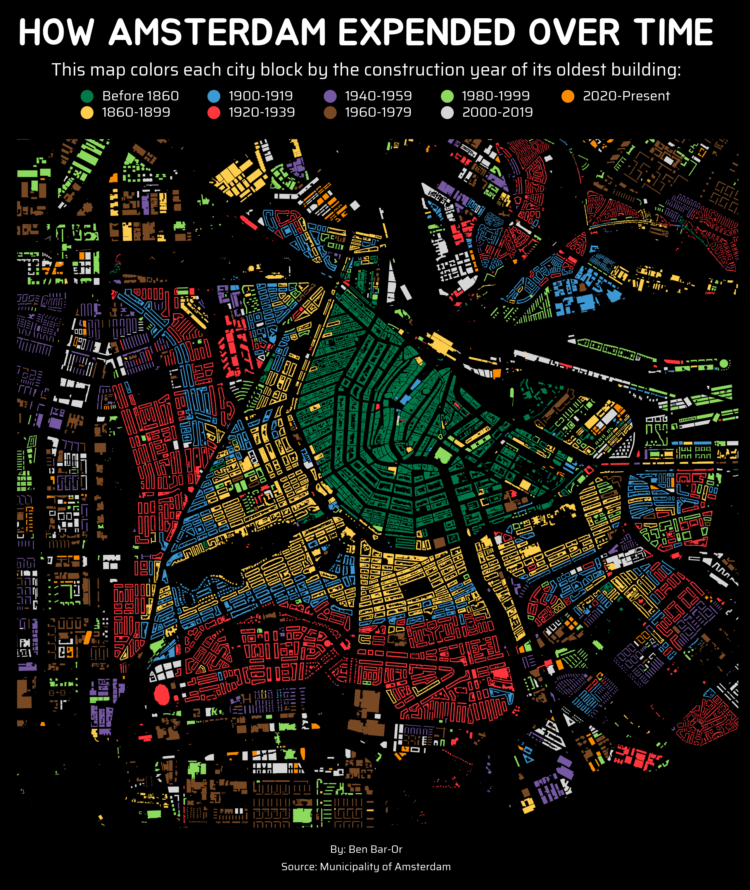

# Amsterdam: Built Over Time 🏙️

**tl;dr:** Explore how Amsterdam grew over the centuries. This map colors building blocks by their **oldest construction year**, showing the city’s expansion from historic cores to modern neighborhoods.

📊 **Visualisation**  

This project is a hands-on exercise in working with geospatial data and creating advanced visualizations in Python. It demonstrates how to:  
- Load and visualize geospatial data with **GeoPandas**  
- Use **categorical color palettes** to represent discrete periods  
- Customize legends (title, labels, fonts) for clarity and style  

The data comes from the **Municipality of Amsterdam**, and all credit for the dataset goes to them.

📂 **How to explore**  
Open the Jupyter Notebook to see the full workflow: [amsterdam_building_age_map.ipynb](amsterdam_building_age_map.ipynb)

💡 **Key learning points / what I practiced:**  
- Geospatial data handling and plotting with Python  
- Working with **categorical colors** in maps  
- Advanced **legend configuration** (position, title, label formatting, font integration)  
